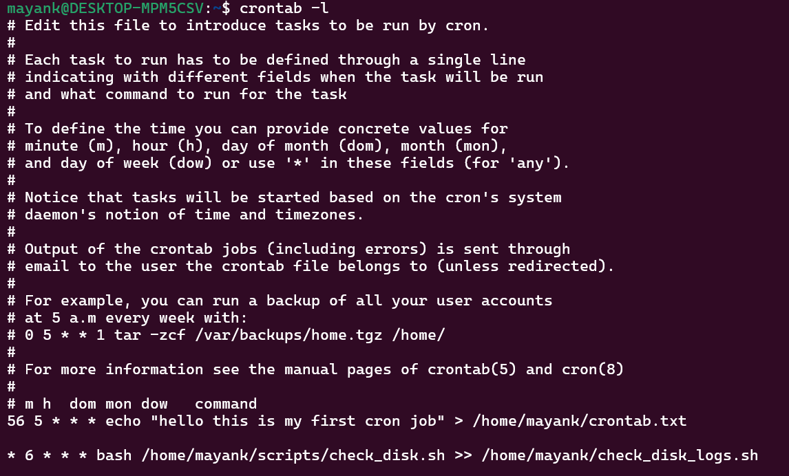
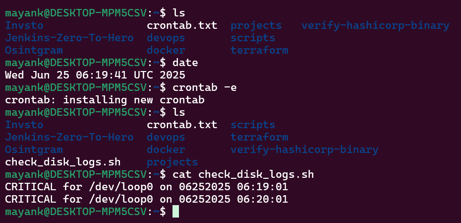

*Tasks
**Create Directories Using Shell Script:
=====================================
#this is script for creating multiple directories
#!/bin/bash

dirname=$1
startno=$2
endno=$3

echo "use the arguments appending ./ command"

for (( i=starno; i<=endno; i++ )); do
  mkdir -p "${dirname}${i}"
done

**Read About Cron and Crontab to Automate the Backup Script:
=====================================
Screenshots of Crontabs and Cronjobs:

**Create 2 users and display their usernames:
=====================================
IDs 0 to 999 are assigned to system users, and local user IDs start from 1000 onwards.
[users](users.png)